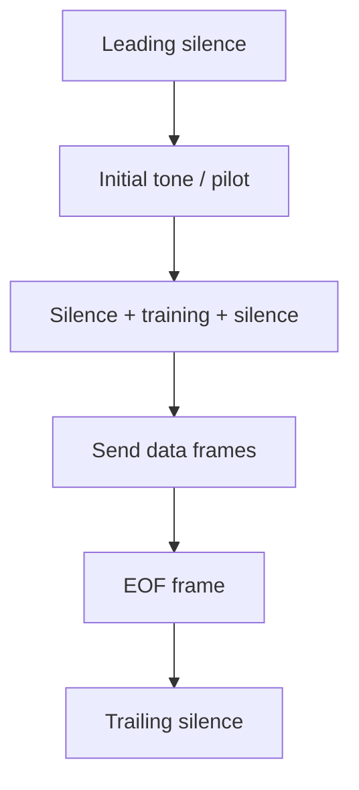

# amodem — on-the-air sequence

**Sender timeline** (what hits the audio path): **silence → pilot tone → (silence + training + silence) → data → EOF → silence**. The receiver **waits for the carrier** early on, then follows that structure until it sees **EOF**.

1. **Leading silence** — `main.send` writes `silence_start` (plus optional `extra_silence`) seconds of zeros to warm the audio path before any modem audio. On receive, `skip_start` can trim a short head of samples before detection.

2. **Initial tone / pilot** — `Sender.start` emits `equalizer.prefix`: repeated pilot carrier scaled by a fixed on/off pattern so the other side can lock. `detect.Detector` waits until coherence on `Fc` stays high, aligns symbol timing (`find_start`), and estimates amplitude and frequency error from this segment.

3. **Silence + training + silence** — Still `Sender.start`: `equalizer.silence_length` symbols of silence, then the PRBS training waveform (`equalizer.train_symbols` / `modulator`), then silence again. `recv.Receiver` checks the pilot pattern (`_prefix`), fits the channel equalizer from the training slice (`_train`), then attaches the FIR for payload decoding.

4. **Send data frames** — `framing.encode` splits input into 250-byte blocks, prepends CRC32 per block, length-prefixes each frame, and streams bits into `Sender.modulate`, which maps bits to QAM symbols on all carriers each baud. `recv.Receiver` demodulates, tracks small clock/phase drift, and `framing.decode_frames` turns bits back into bytes.

5. **EOF frame** — After the last data block, `Framer.encode` emits one more frame whose payload is `Framer.EOF` (`b''`). `Framer.decode` stops and signals end-of-transfer when that checksum-valid empty payload is seen.

6. **Trailing silence** — `main.send` appends `silence_stop` seconds of zeros so the line dies away cleanly after the last symbols; the receiver has already finished on EOF.

CLI **`calib.recv`** is only for level/tone checks, not this transfer sequence.
